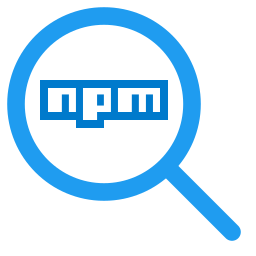

<p align="center">
  
</p>

<h1 align="center">npm LL: Package Manager &amp; Library Lens</h1>

<p align="center">npm package management and Library Lens for Node.js workspaces.</p>

npm LL brings a Visual Studio-style package experience to VS Code for npm projects: scan your workspace, browse and search packages, install into one or many workspace packages, keep dependencies updated, and stay on top of vulnerable or deprecated packages — all from a fast, dark, blue-accented dashboard and a dedicated sidebar.

> **Screenshots coming soon.**

## Features

- **Workspace scanner** — detects every `package.json` across all workspace folders (root and `workspaces` monorepo members) plus `.npmrc` files, always skipping `node_modules`, `.git`, `dist`, and friends.
- **Sidebar** — at-a-glance counts for workspace packages, dependencies, outdated, vulnerable, and configured registries, plus a per-package launcher into the dashboard.
- **Dashboard** — a polished webview with Overview, Browse, Installed, Updates, Vulnerabilities, Registries, and Settings tabs.
- **Search** — npm registry HTTP API search against registry.npmjs.org (or your configured registry), with an `npm search` fallback.
- **Package details** — versions, license, author, homepage/repository, keywords, dependencies, deprecation info, and the workspace packages that declare the dependency.
- **Dependency types** — `dependencies`, `devDependencies`, `peerDependencies`, and `optionalDependencies` are surfaced per package and respected on install (`--save-dev`, `--save-optional`, etc.).
- **Install / update / remove** — into one or multiple workspace packages at once, with version pickers (latest, latest prerelease, or a specific version/range) and confirmation before multi-package changes.
- **Installed vs declared** — shows the declared semver range alongside the version actually resolved in `node_modules`, and flags dependencies that are declared but not installed.
- **Outdated / vulnerable / deprecated reports** — powered by `npm outdated --json`, `npm audit --json`, and registry deprecation metadata, with batch updates and advisory links, streamed one package at a time.
- **Registry inspector** — lists the registries configured in `.npmrc` (default and scoped), shows whether auth is configured, and opens `.npmrc` for editing.
- **Install dependencies** — run `npm install` for the whole workspace or a single package with progress and full output logging.
- **Live refresh** — file watchers refresh the model (debounced 500 ms) whenever `package.json` or `.npmrc` files change (`node_modules` churn is ignored).

## How to use

1. Open a workspace that contains a `package.json`.
2. Click the **npm LL** icon in the activity bar to see your packages and dependencies.
3. Run **npm LL: Open Dashboard** (or click the dashboard icon) for the full UI.
4. In **Browse**, search for a package, pick a dependency type, a version, and target packages, and click **Install**.
5. Use **Updates** and **Vulnerabilities** to keep your dependency graph healthy.

## Commands

| Command | Description |
| --- | --- |
| `npm LL: Open Dashboard` | Open the npm LL dashboard webview |
| `npm LL: Refresh Workspace` | Rescan packages and dependencies |
| `npm LL: Search Packages` | Search npm packages |
| `npm LL: Add Package` | Install a package into one or more workspace packages |
| `npm LL: Update Package` / `Update All Packages` | Update dependencies |
| `npm LL: Remove Package` | Remove a package |
| `npm LL: Check Outdated / Vulnerable / Deprecated Packages` | Run dependency health checks |
| `npm LL: Install Dependencies` / `Install Dependencies (Package)` | Run `npm install` |
| `npm LL: Manage Registries` / `Open .npmrc` | Inspect npm registries |
| `npm LL: Open Output Channel` | Show detailed logs |
| `npm LL: Open Settings` | Open npm LL settings |

## Requirements

- VS Code 1.96+
- [Node.js](https://nodejs.org/en/download) and npm on your `PATH` (`npm --version` should work). npm LL detects npm on activation and disables package actions with a clear message if it is missing.
- Installed versions are read from `node_modules`; run an install if `node_modules` is missing so resolved versions and audit results are accurate.

## Known limitations

- v1 supports **npm only**. yarn/pnpm lockfiles and CLIs are not yet handled (planned as sibling services).
- Registries are **read-only** — npm LL reads `.npmrc` but does not add/remove registries or write auth tokens; edit `.npmrc` directly.
- Private/scoped registries that require auth are queried unauthenticated for metadata, so private package details may fall back to the npm CLI.
- There is no central-version-management concept (no `Directory.Packages.props` analog).

## Privacy & security

- npm LL talks only to the registries you configure (registry.npmjs.org by default) and runs the `npm` CLI locally.
- Commands are executed via `spawn` with argument arrays — never through a shell.
- Passwords, tokens, API keys, and URL-embedded credentials are masked in the npm LL output channel and the UI.
- npm LL never reads or stores `.npmrc` auth tokens; it only detects whether auth is configured.
- File edits are restricted to files inside your workspace, and the workspaces-root `package.json` is only modified after confirmation.

## Roadmap

- yarn / pnpm support (sibling CLI services)
- Workspace-wide version alignment helpers
- Dependency graphs and SBOM reports
- Search across multiple registries simultaneously

## Development

```bash
npm install
npm run compile
code .
# Press F5 to launch the Extension Development Host
```

Other scripts: `npm run watch`, `npm run lint`, `npm run test`, `npm run package`, `npm run webview:dev`, `npm run webview:build`.

## License

[MIT](LICENSE)
